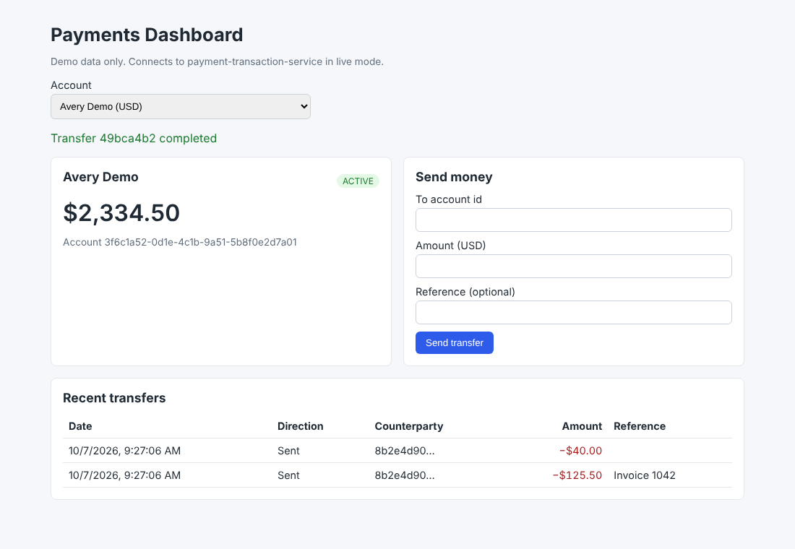

# Payments Dashboard (React + TypeScript)

A small React front end for the [payment-transaction-service](https://github.com/deekshita21/payment-transaction-service) API: view an account balance, send a transfer, and page through transfer history.

> **Portfolio project.** I wrote this independently with synthetic data. It does not contain code, data, or designs from any employer or client.




## What it shows

- **Typed API layer.** One `PaymentsApi` interface with two implementations: an HTTP client for the Spring Boot service and an in-memory mock that follows the same business rules (insufficient funds, frozen accounts, currency match, idempotency).
- **Safe retries from the UI.** The form keeps one `Idempotency-Key` per logical transfer. Retrying after a network error reuses the key, so the backend cannot charge twice; editing the form or a successful send creates a new key.
- **Client-side validation that matches the server.** UUID format, positive amount with at most two decimals, no overdraft, no transfer to the same account. Server problem details (`code`, `detail`) are shown when the backend rejects a request.
- **Accessible markup.** Labeled inputs, `role="alert"` for errors, `role="status"` for confirmations, and tests that query by role and label.

## Tech stack

React 19 · TypeScript (strict) · Vite · Vitest · React Testing Library · user-event · jsdom · GitHub Actions

## Run

```bash
npm ci
npm run dev            # mock mode with demo data at http://localhost:5173
```

Live mode against the Spring Boot service running on port 8080:

```bash
cp .env.example .env.local
# set VITE_API_MODE=live and a local dev token from the service repo's scripts/dev-token.sh
npm run dev
```

## Tests

```bash
npm test               # 12 tests: API rules, form validation, idempotent retry, end-to-end UI flow
npx tsc -b             # strict type check
```

## Limitations and next steps

- The dev token is read from an env variable for local testing only; a real deployment would use an OAuth 2.0 authorization-code flow with PKCE and keep tokens out of browser storage.
- Account selection uses fixed demo accounts; a search endpoint would replace it.
- Next: React Query for caching and retries, Playwright end-to-end tests against the Docker Compose stack.

## License

MIT
